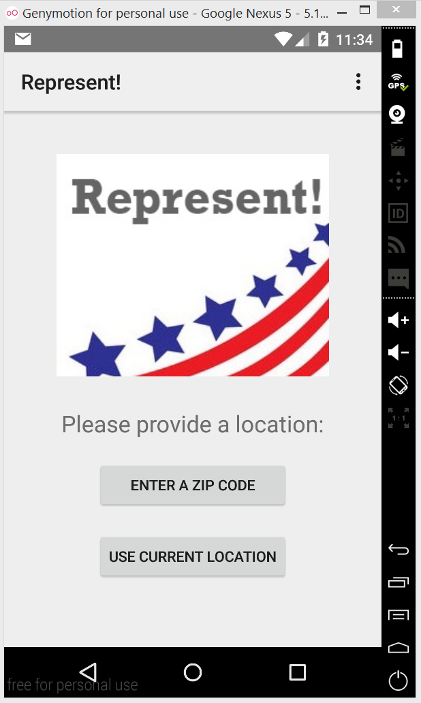
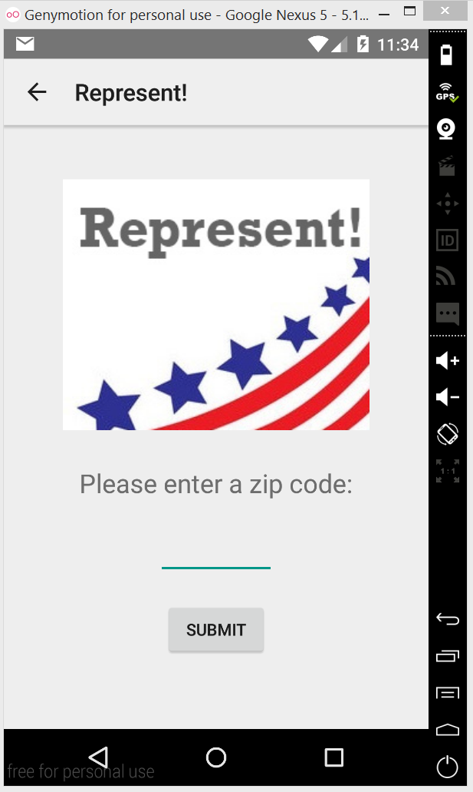
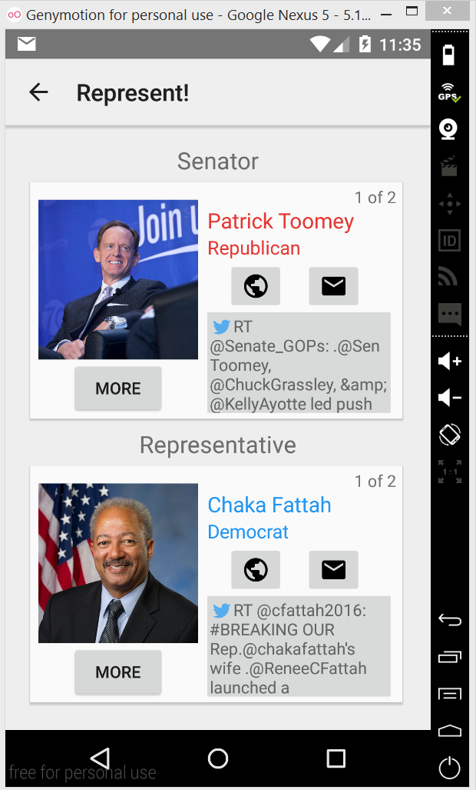
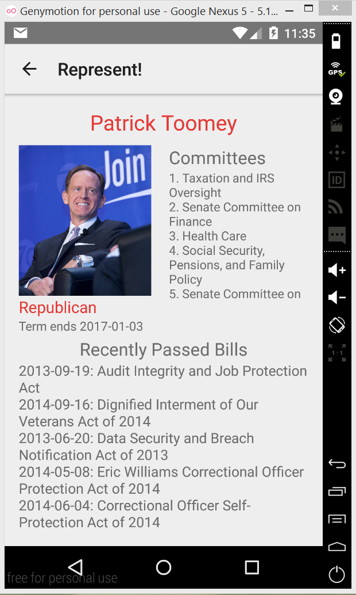
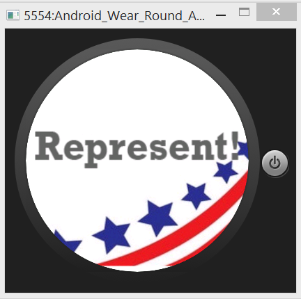
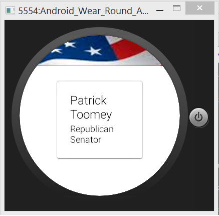
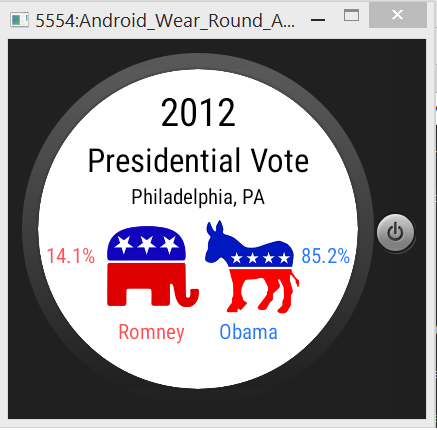

# PROG 02: Represent!

Shows local representatives and more! Communicates between your phone and watch for maximum browsing convenience.

## Authors

Richard Hu([rhu@berkeley.edu](mailto:rhu@berkeley.edu))

## Demo Video

See Prog2-B Demo(https://www.youtube.com/watch?v=oiBQuuM-BVY)

## Screenshots

## Acknowledgments

* Stack Overflow for a lot of inspiration and help, specifically the algorithm for shake detection/accelerometer readings and a lot of the API implementation code.
* Fabric, Sunlight Foundation and Google APIs for being greatly helpful.
* Fellow students for the knowledge of the in-built back button
* Instructors for being great in providing answers on Piazza and ruining my Friday (jk)
